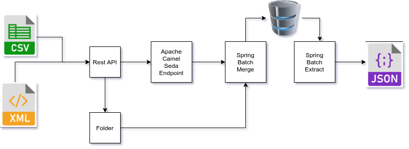

Merge a CSV and a XML files into a JSON file. 



The solution is deployed on Spring Boot with Spring Batch and Apache camel. 

[Spring Boot](https://spring.io/projects/spring-boot)

[Spring Batch](https://camel.apache.org)

[Apache Camel](https://www.mailgun.com)

# Prerequites
* JDK 11
* Maven

# Setup
### Build
```console
cd member-management-batch
mvn clean install
```
### Start Server

```console
./mvnw spring-boot:run
```

# Testing

### Run test
```console
cd src/test/resources/payload/sample001
./curl-test.sh
```
